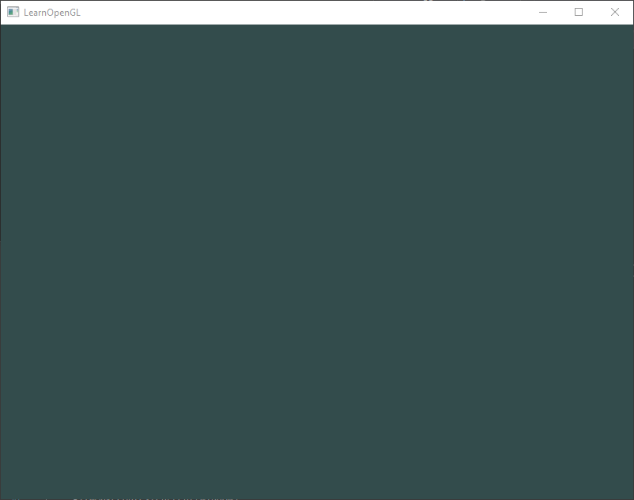
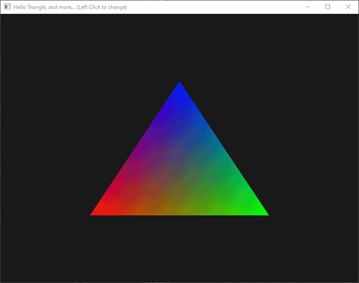
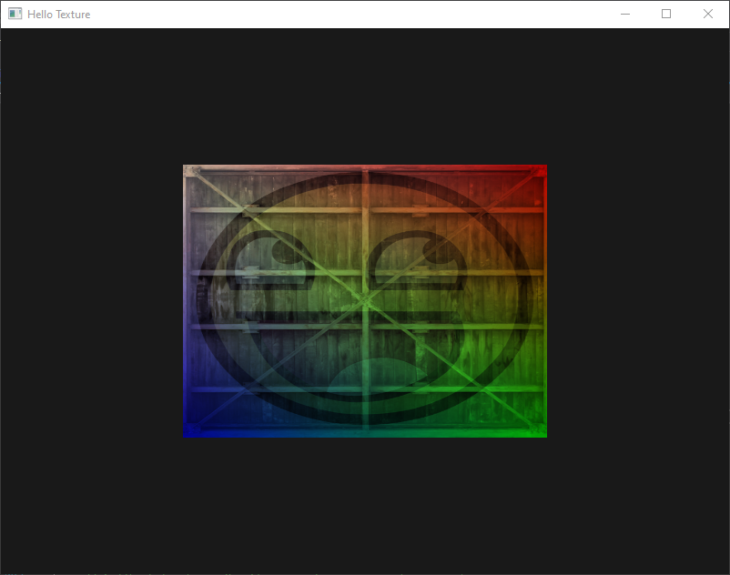
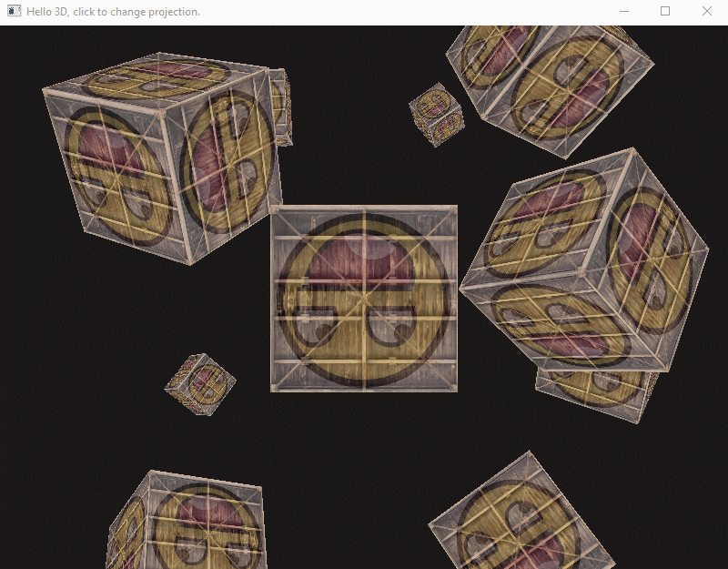
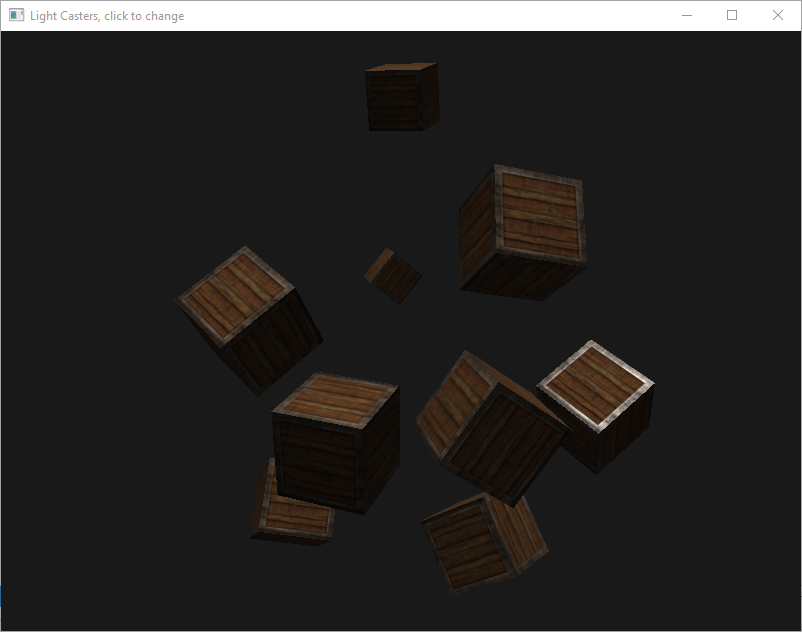
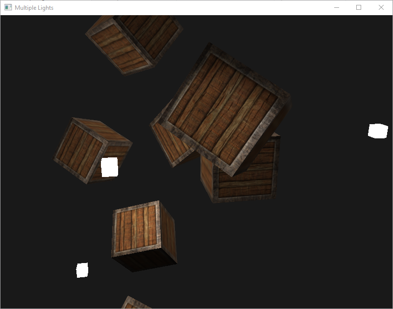
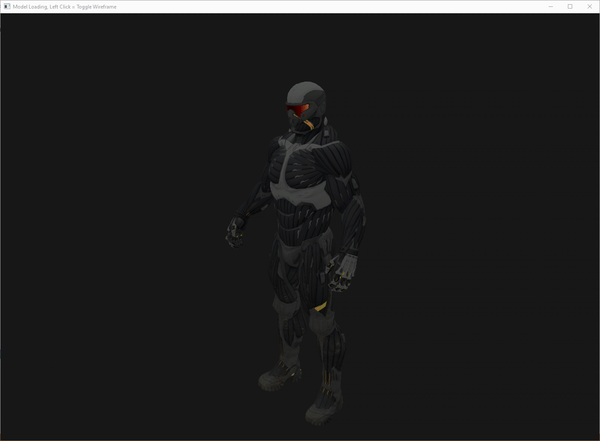

# LearningOpenGL
Creating things using OpenGL. Based on tutorials from <a>https://learnopengl.com/</a>. Preview images do not reflect actual performance or image quality.

## Table of Contents  
[1 - Hello World](#1---hello-world)
<a name="1 - Hello World"/>

[2 - Hello Triangle](#2---hello-triangle)
<a name="2 - Hello Triangle"/>

[3 - Hello Texture](#3---hello-texture)
<a name="3 - Hello Texture"/>

[4 - Hello Transform](#4---hello-transform)
<a name="4 - Hello Transform"/>

[5 - Hello 3D](#5---hello-3d)
<a name="5 - Hello 3D"/>

[6 - Hello Camera](#6---hello-camera)
<a name="6 - Hello Camera"/>

[7 - Basic Lighting](#7---basic-lighting)
<a name="7 - Basic Lighting"/>

[8 - Materials](#8---materials)
<a name="8 - Materials"/>

[9 - Lighting Maps](#9---lighting-maps)
<a name="9 - Lighting Maps"/>

[10 - Light Casters](#10---light-casters)
<a name="10 - Light Casters"/>

[11 - Multiple Lights](#11---multiple-lights)
<a name="11 - Multiple Lights"/>

[12 - Model Loading](#12---model-loading)
<a name="12 - Model Loading"/>

## 1 - Hello World

## 2 - Hello Triangle

## 3 - Hello Texture

## 4 - Hello Transform

## 5 - Hello 3D

## 6 - Hello Camera

## 7 - Basic Lighting

## 8 - Materials

## 9 - Lighting Maps

## 10 - Light Casters

## 11 - Multiple Lights

## 12 - Model Loading

